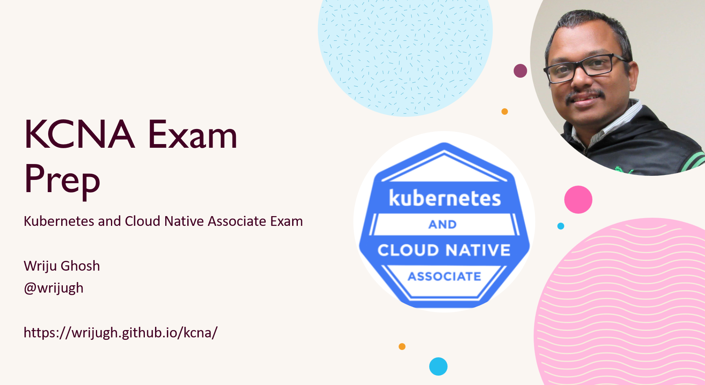

# KCNA Exam Prep

Exam Prep Guide for Kubernetes and Cloud Native Associate (KCNA). 

[https://wrijugh.github.io/kcna/](https://wrijugh.github.io/kcna/)

Released in Nov 2021. For official guidance please always refer the official guidance. 

## Exam Registration Page
[https://training.linuxfoundation.org/certification/kubernetes-cloud-native-associate/](https://training.linuxfoundation.org/certification/kubernetes-cloud-native-associate/)

## Candidate Handbook
[https://docs.linuxfoundation.org/tc-docs/certification/lf-handbook2](https://docs.linuxfoundation.org/tc-docs/certification/lf-handbook2)

## Curriculam
[https://github.com/cncf/curriculum/blob/master/KCNA_Curriculum.pdf](https://github.com/cncf/curriculum/blob/master/KCNA_Curriculum.pdf)

### 46% - Kubernetes Fundamentals
- Kubernetes Resources
	[https://kubernetes.io/docs/concepts/overview/components/](https://kubernetes.io/docs/concepts/overview/components/)
- Kubernetes Architecture
	[https://kubernetes.io/docs/concepts/architecture/](https://kubernetes.io/docs/concepts/architecture/)
- Kubernetes API
	[https://kubernetes.io/docs/concepts/overview/kubernetes-api/](https://kubernetes.io/docs/concepts/overview/kubernetes-api/)
- Containers
	[https://kubernetes.io/docs/concepts/containers/](https://kubernetes.io/docs/concepts/containers/)
- Scheduling
	[https://kubernetes.io/docs/concepts/scheduling-eviction/](https://kubernetes.io/docs/concepts/scheduling-eviction/)

### 22% - Container Orchestration
- Container Orchestration Fundamentals
	[https://www.ibm.com/cloud/learn/container-orchestration](https://www.ibm.com/cloud/learn/container-orchestration)
- Runtime
	[https://kubernetes.io/docs/concepts/containers/runtime-class/](https://kubernetes.io/docs/concepts/containers/runtime-class/)
- Security
	[https://kubernetes.io/docs/concepts/security/](https://kubernetes.io/docs/concepts/security/)
- Networking
	[https://kubernetes.io/docs/tasks/network/](https://kubernetes.io/docs/tasks/network/)
- Service Mesh
	[https://glossary.cncf.io/service_mesh/](https://glossary.cncf.io/service_mesh/)
	[https://openservicemesh.io/](https://openservicemesh.io/)
	[https://istio.io/latest/about/service-mesh/](https://istio.io/latest/about/service-mesh/)
- Storage
	[https://kubernetes.io/docs/concepts/storage/](https://kubernetes.io/docs/concepts/storage/)

### 16% - Cloud Native Architecture

Open Standards: Anchoring Extensibility for Cloud-Native Tooling - Katie Gamanji, CNCF
[https://www.youtube.com/watch?v=yMj92DK6R-A](https://www.youtube.com/watch?v=yMj92DK6R-A)

Cloud Native Landscape [https://landscape.cncf.io](https://landscape.cncf.io)
        
Cloud Native Glossary [https://glossary.cncf.io/](https://glossary.cncf.io/)
	
- Cloud Native Architecture Fundamentals
	[https://www.ibm.com/cloud/architecture/architecture/practices/cloud-native-principles/](https://www.ibm.com/cloud/architecture/architecture/practices/cloud-native-principles/)
- Autoscaling
	[https://glossary.cncf.io/auto_scaling/](https://glossary.cncf.io/auto_scaling/)

- Serverless
	[https://glossary.cncf.io/serverless/](https://glossary.cncf.io/serverless/)
- Community and Governance
	[https://www.cncf.io/blog/2019/08/30/cncf-technical-principles-and-open-governance-success/](https://www.cncf.io/blog/2019/08/30/cncf-technical-principles-and-open-governance-success/)
- Personas
	[https://www.ibm.com/docs/en/cloud-paks/cp-management/1.3.0?topic=about-personas-use-cases](https://www.ibm.com/docs/en/cloud-paks/cp-management/1.3.0?topic=about-personas-use-cases)

- Open Standards
	- Container Runtime Interface (CRI) 
	CRI implemented for Kubernetes for OCI (Open Container Initiative)
	[https://kubernetes.io/docs/concepts/architecture/cri/](https://kubernetes.io/docs/concepts/architecture/cri/)
	
	- Container Network Interface (CNI)
	    [https://github.com/containernetworking/cni](https://github.com/containernetworking/cni)
    
        [https://www.youtube.com/watch?v=l2BS_kuQxBA](https://www.youtube.com/watch?v=l2BS_kuQxBA)

	- Container Storage Interface (CSI)
	    [https://kubernetes.io/blog/2019/01/15/container-storage-interface-ga/](https://kubernetes.io/blog/2019/01/15/container-storage-interface-ga/)
    
        [https://kubernetes-csi.github.io/docs/](https://kubernetes-csi.github.io/docs/)
    
	- Service Mesh Interface (SMI)
        [https://github.com/servicemeshinterface/smi-spec/blob/main/SPEC_LATEST_STABLE.md](https://github.com/servicemeshinterface/smi-spec/blob/main/SPEC_LATEST_STABLE.md)

        [https://smi-spec.io/](https://smi-spec.io/)
	
	- Cloud Provider Interface (CPI)
        [https://cloud-provider-vsphere.sigs.k8s.io/cloud_provider_interface.html](https://cloud-provider-vsphere.sigs.k8s.io/cloud_provider_interface.html)

### 8% - Cloud Native Observability
- Telemetry & Observability
	Metrics, Events, Logs, Traces
	
    OpenTelemetry 
    [https://opentelemetry.io/](https://opentelemetry.io/)
	
    [https://glossary.cncf.io/observability/](https://glossary.cncf.io/observability/)
- Prometheus
	[https://prometheus.io/docs/introduction/overview/](https://prometheus.io/docs/introduction/overview/)
- Cost Management
	[https://www.finops.org/introduction/what-is-finops/](https://www.finops.org/introduction/what-is-finops/)

### 8% - Cloud Native Application Delivery
- Application Delivery Fundamentals
	[https://glossary.cncf.io/agile_software_development/](https://glossary.cncf.io/agile_software_development/)
	[https://glossary.cncf.io/application_programming_interface/](https://glossary.cncf.io/application_programming_interface/)
- GitOps
	
    [https://www.weave.works/technologies/gitops/](https://www.weave.works/technologies/gitops/)
    
    [https://www.weave.works/technologies/monitoring-kubernetes-with-prometheus/#deploy-new-features](https://www.weave.works/technologies/monitoring-kubernetes-with-prometheus/#deploy-new-features)
    
    GitOps E-book [https://www.gitops.tech/](https://www.gitops.tech/)

- CI/CD

	[https://glossary.cncf.io/continuous_integration/](https://glossary.cncf.io/continuous_integration/)
	[https://glossary.cncf.io/continuous_delivery/](https://glossary.cncf.io/continuous_delivery/)
	[https://glossary.cncf.io/continuous_deployment/](https://glossary.cncf.io/continuous_deployment/)

## Additional Resources

- FreeCodeCamp 14 hour course 
	[https://www.youtube.com/watch?v=AplluksKvzI](https://www.youtube.com/watch?v=AplluksKvzI)

- 